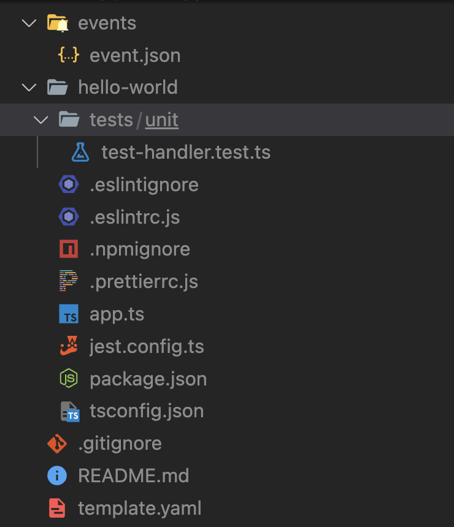

import CodeViewer from '@site/src/components/CodeViewer';

## Install

Let's start gathering all tool required for our sam app. We will be using nodejs as lambda runtime language. Javascript does not provides typing support. To get typing support we will be writing our code in typescript and then compiling it into javascript.

Here is the list of tool we need for our app.
* **Python3** is required to run AWS CLI and SAM CLI. Use [this](https://www.python.org/downloads/) link to install python. Run `python --version` to check if python is installed properly on not.
* **PIP** is a python package manager. We will be using it to install SAM CLI. Use [this](https://pip.pypa.io/en/stable/installation/) link to install latest version of PIP. Run `pip --version` to check if PIP is installed correctly or not.
* **AWS CLI** is required to run SAM CLI. SAM CLI will use AWS CLI at the time of deploying our application. Use [this](https://docs.aws.amazon.com/cli/latest/userguide/getting-started-install.html) link to install AWS CLI. Run `aws --version` to check if AWS CLI is properly installed.
* **SAM CLI** will be used for initializing & deploying our application. It can be used for building our app, but we will be using webpack for that. Run below commands to install SAM CLI.
> ```bash
> pip install aws-sam-cli
> sam --version # To check if SAM CLI is installed properly
> ```
* **NodeJS** will be used for the development of our application. We will be using develpment tools such as webpack, ts-loader, typescript etc. And to run these tools we need NodeJS & NPM(node package manager). You can download LTS(long term support) version of NodeJS from [this](https://nodejs.org/en/download/) link. Run `node --version` & `npm --version` to check if NodeJS & NPM are installed properly.

***

## Configure

After installation, let us config our AWS credentials. Login to you AWS account and navigate to IAM service. Create an IAM user with admin access and keep `Access key ID` & `Secret access key` of this user at some safe place. Run below command to configure your credentials.
```bash
aws configure
```
To verify your credentials are configured correctly, run below command.
```bash
aws sts get-caller-identity
```
You should get a json output like this.
```json
{
  "UserId": "someuserid",
  "Account": "someaccountid",
  "Arn": "arn:aws:iam::somid:user/aws_cli"
}
```

***

## Initialize

Now with the help of SAM CLI, we will initialize our app. Follow the below steps to generate a hello-world app.
1. Run cmd `sam init`.
2. Choose `Aws Quick Start Templates`.
3. Choose `Hello world Example` template from the available options.
4. Choose your preferred NodeJS version with typescript.
5. Choose packaging mode as `zip`.

:::note Info 
After cloning, your folder structure should look like this.


:::

***

## Refactor

In `Hello world` template, our source code, package.json & tsconfig.json are inside a folder named hello-world. This folder structure is fine if we have `mono-repo`, where a single repository hosts multiple apps and each app has its dependencies. However, we are going to build a simple CRUD app. Therefore we should reorganize our files. 

Following are the steps to reorganize our files:
1. Rename folder `hello-world` to `src`.
2. Move `package.json` & `tsconfig.json` from folder `src` to root of project.
3. Add these scripts to the package.json.
> ```json showLineNumbers title="package.json"
> "scripts": {
>  "build": "npx webpack",
>  "deploy": "sam deploy --stack-name prod --s3-bucket your-s3-bucket-name --capabilities CAPABILITY_IAM",
> },
> ```
:::note Info
Do not forget to replace `your-s3-bucket-name` with your actual S3 bucket name in deploy script.
:::
4. Remove `noEmit: false` from tsconfig.json.
5. Open `templat.yaml` file and locate `HelloWorldFuction` under resources. Update this resource with below code.
> <CodeViewer 
> language="yaml"
> title="templat.yaml"
> url="https://raw.githubusercontent.com/VinitTomar/todo-aws-sam/setup/template.yaml"
> start="12"
> end="26"></CodeViewer>
6. Run following command to install `webpack`, `webpack-cli`, `typescript` & `ts-loader` as dev dependencies.
> ```bash
> npm install -D webpack webpack-cli typescript ts-loader
> ```
7. Add `webpack.config.js` to the root of your project and add below code.
> <CodeViewer 
> language="js"
> title="webpack.config.js"
> url="https://raw.githubusercontent.com/VinitTomar/todo-aws-sam/setup/webpack.config.js"
> ></CodeViewer>

***

## Build

Our source code is written in `typescript`. Therefore we need to compile it into `javascript`. We are using webpack for compiling and bundling our typescript code. Webpack writes the compiled javascript into the `dist` folder as per configuration in the `webpack.config.js` file. Run this command to build our code.
```bash
npm run build
```
<details>
  <summary>SAM CLI support for typescript</summary>
  <div>
    AWS SAM CLI has also started support for typescript. This feature is in beta. While working with this example I found that <code>sam cli build</code> cmd is very slow as compare to the webpack build. <code>sam cli build</code> copies the <code>node_modules</code> folder before building our app. This could be the reason for slow build of <code>sam cli</code>. If you want to more you can find it <a href="https://aws.amazon.com/blogs/compute/building-typescript-projects-with-aws-sam-cli/" target="_blank">here</a>.
  </div>
</details>

***

## Deploy

Run below command to deploy our app to AWS.
```bash
npm run deploy
```
Now log in to AWS cloud formation and you will creation of a stack in progress. If every thing goes right our app will be deployed successfully.

:::info Tip
If you want more control of deployment process you can run below command.
```bash
sam deploy --guided
```
:::

***

## Run

After the deployment is completed, you will get an URL ending with `/Prod/Hello` in the outputs. Open this URL in browser and you will get below response.
```json
{
  "message": "hello world"
}
```
Congratulations, your have completed the setup. Lets continue to build our CRUD app.


