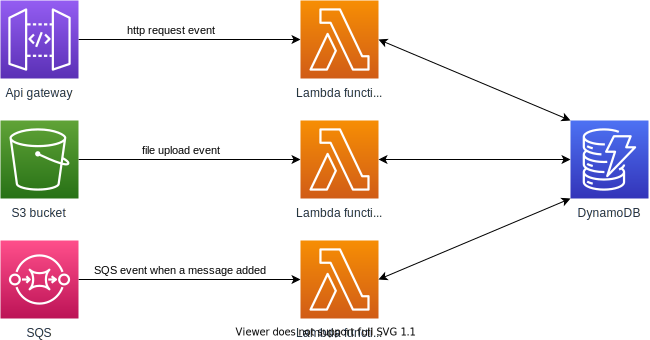

SAM is serverless application model for AWS for running serverless applications. With the help of SAM, we can create serverless applications declaratively. SAM uses a file commonly named as template.yaml to get the information about the AWS services required for our serverless application. File template.yaml has different sections for different purpose but the most important is the Resources section. This is the place where we declare all AWS services required for our application.

A typical anatomy of a serverless application contains Lambda functions, sources of events and other resources such as a database, which are required to run our lambda function. In AWS ecosystem S3, API Gateway, SNS & SQS are generally used as source of event.

To work with SAM application we uses `sam`, a cli tool. We use sam cli for initializing, building and deploying our application. To run `sam cli` we also need python and `aws cli` to be installed. In the next tutorial we are going to install all these tool required for our sam app.