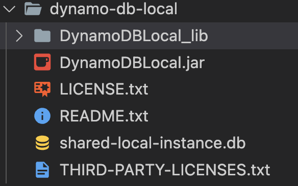

import AWSConfigure from '../partials/_aws-configure.md';


There are two ways we can access DynamoDB. Either you can use it as an amazon web service or you can setup in your local system. For both ways, you should provide configure AWS credentials first. In the case of local system setup, there is no need for credentials to be real, you can use any **fake** credentails. However, for web services credentials should be real.

If you want to save some money I would suggest continuing with [locally](#local-setup) setup DynamoDB.

## As a web service

If you have AWS CLI installed you can run the below command to configure your credentials. You need to enter `Access key ID` & `Secret access key` which you can get from the AWS IAM console.

<AWSConfigure />

### DynamoDB service

To check if you are able to create a table run the below command and wait for a few seconds.

```bash
aws dynamodb create-table \
    --table-name DummyTable \
    --attribute-definitions \
        AttributeName=Id,AttributeType=N \
    --key-schema \
        AttributeName=Id,KeyType=HASH \
    --provisioned-throughput \
        ReadCapacityUnits=10,WriteCapacityUnits=5
```

Go to the DynamoDB service in your AWS console. Check if the table is available or not. Or you can run the below command to check if the table is available.

```bash
aws dynamodb wait table-exists --table-name DummyTable
```

Now you are ready to use AWS DynamoDB service.

***

## Local setup

### JRE

To run DynamoDB locally JRE(Java runtime environment) 8.x is required. If you are using Linux or Mac then most probably java is already available on your system. You can check if JRE is available by running:

```bash
java -version
```

You should get output like this

```
openjdk version "11.0.11" 2021-04-20
OpenJDK Runtime Environment (build 11.0.11+9-Ubuntu-0ubuntu2)
OpenJDK 64-Bit Server VM (build 11.0.11+9-Ubuntu-0ubuntu2, mixed mode)
```

If java is not installed, you can download and install it from here https://www.java.com/en/download/.

### DynamoDB
1. Download DynamoDB https://s3.ap-south-1.amazonaws.com/dynamodb-local-mumbai/dynamodb_local_latest.zip.
2. Extract content from the zip file. The content for the zip should look like this.
>
3. Go inside the directory where you have extracted the DynamoDB zip file.
4. Run this command to start the DynamoDB instance.
>```bash
>java -Djava.library.path=./DynamoDBLocal_lib -jar DynamoDBLocal.jar -sharedDb
>```
5. Run `aws configure` and enter fake credentials.
6. Run this command to check if DynamoDB is working. Make sure that port 8000 is available.
>```bash
>aws dynamodb create-table \
>    --table-name DummyTable \
>    --attribute-definitions \
>        AttributeName=Id,AttributeType=N \
>    --key-schema \
>        AttributeName=Id,KeyType=HASH \
>    --provisioned-throughput \
>        ReadCapacityUnits=10,WriteCapacityUnits=5 \
>    --endpoint-url http://localhost:8000
>```
7. Check if table is created or not.
>```bash
>aws dynamodb wait table-exists --table-name DummyTable --endpoint-url http://localhost:8000
>```

If everything goes fine as per the above step then you are ready to use DynamoDB locally.

<details>
  <summary>More info on how to deploy DynamoDB locally</summary>
  <div>
    If you are stuck anywhere, you can visit this link https://docs.aws.amazon.com/amazondynamodb/latest/developerguide/DynamoDBLocal.DownloadingAndRunning.html for more information.
  </div>
</details>

### DynamoDB-Admin

It is always nice to have a GUI to interact with our database. For local DynamoDB setup, we can use `dynamodb-admin`.

If you have nodejs in your system, as you should because we are going to use typescript for our examples, then you can use this command to install `dyanmodb-admin` globally.
```bash
npm install -g dynamodb-admin
```

Run the command `dynamodb-admin` in the terminal and then open `http://localhost:8001` in the browser.
Now your GUI is also available for managing DynamoDB.
